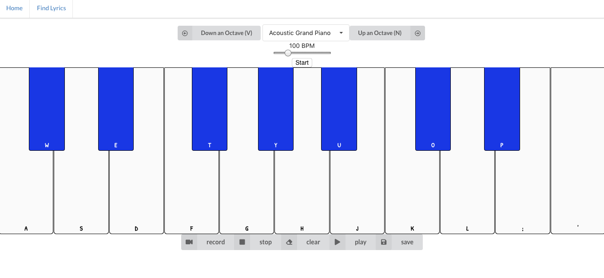
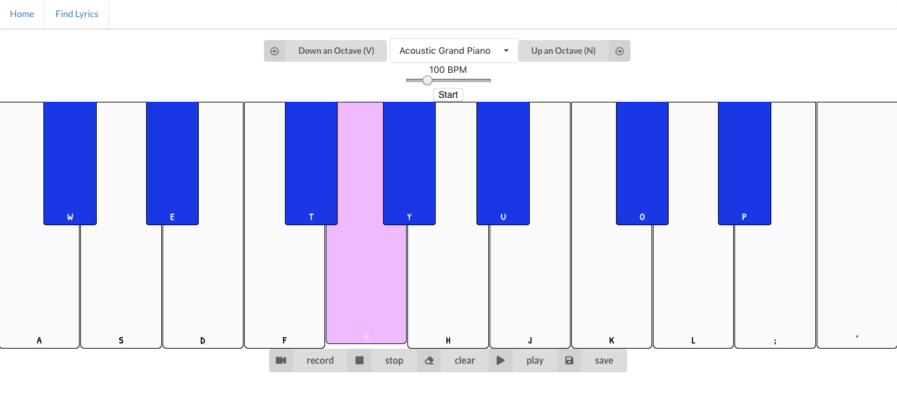
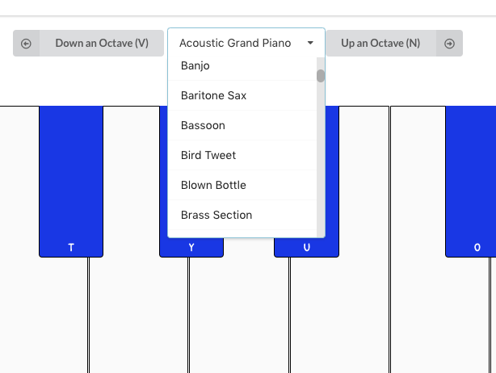
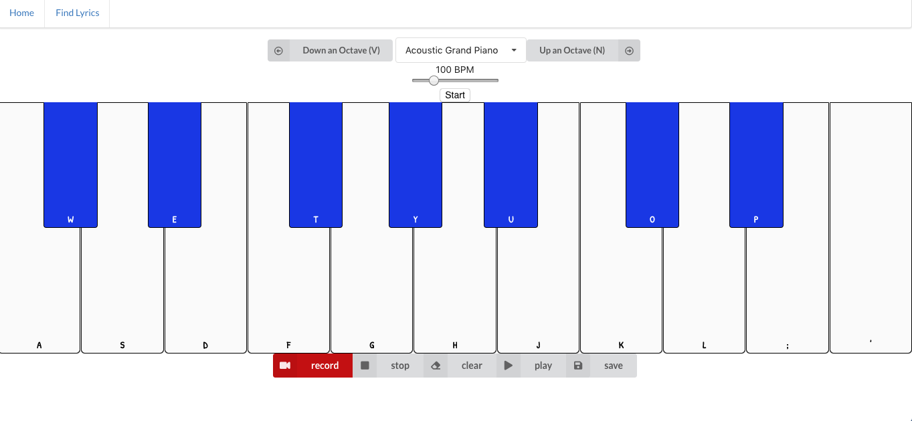
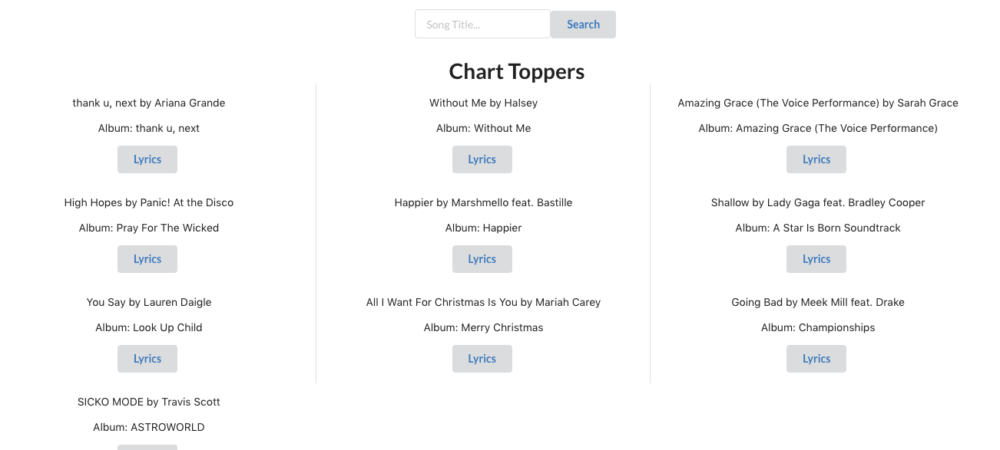
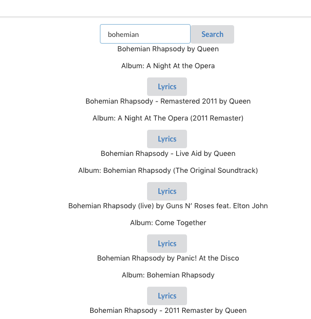

<h1 align="center">
  <br>
  
  <br>
MIDIRO  
<br>
</h1>

<h4 align="center">An Interactive Midi Piano with over 120 different instruments. </h4>

<p align="center">
  <a href="#key-features">Key Features</a> •
  <a href="#how-to-use">How To Use</a> •
  <a href="#about-this-app">About This App</a> •
  <a href="#images">Images</a> •
</p>

<a href="https://youtu.be/uaLlWjeX7ZE">Watch The Demo Video!</a>

## Key Features

- Piano
  - You can use the shortcuts to play the corresponding keys.
  - The keys match the shape of the keyboard relatively.
  - Use the "V" and "N" shortcuts to quickly move up and down octaves while playing.
- Instruments
  - This app comes with over 120 available instruments you can pick and play with.
  - The piano resets its keys to its original position everytime you change an instrument.
- Recording
  - You can record and playback your recordings. There is no recording time limit, as far as is reasonably tested.
- Lyrics Finder
  - In the next tab you will find a lyric finder.
  - This app uses the MusixMatch API to fetch lyrics to your favorite songs.

## How To Use

To clone and run this application, you'll need [Git](https://git-scm.com)

```bash
# Clone this repository
$ git clone https://github.com/samashtar/midiro

#now cd into the folder
$ cd midiro

# install dependencies and run it
$ npm i && npm start
```

## About This App

- Web Audio API for sound creation
- Soundfont Loader Library to Load Different Instruments
- Keyboard keys function as shortcuts to piano keys
- Recording and Playback
- BPM Metronome
- MusixMatch API to create a Lyric Finder
- Find lyrics to any song you search
- React.js Framework
- Semantic-UI Styling
- Secure Postgres Database
- Rails API for users and songs
- Full CRUD functionality and follows REST conventions

## Images

<h3 align="center">
Note Pressed  <br>
  
  <br>
<br>
</h3>
<h3 align="center">

<h3 align="center">
Change Your Instrument  <br>
  
  <br>
<br>
</h3>

<h3 align="center">
Record  <br>
  
  <br>
<br>
</h3>
<h3 align="center">

<h3 align="center">
 Lyric Finder
  <br>
  
  <br>
<br>
</h3>

<h3 align="center">
Search Lyrics  <br>
  
  <br>
<br>
</h3>
<h3 align="center">

---

> GitHub [@samashtar](https://github.com/samashtar/) &nbsp;&middot;&nbsp;
